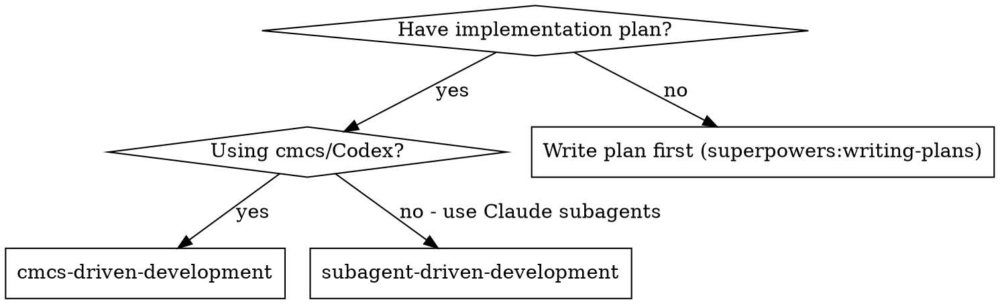
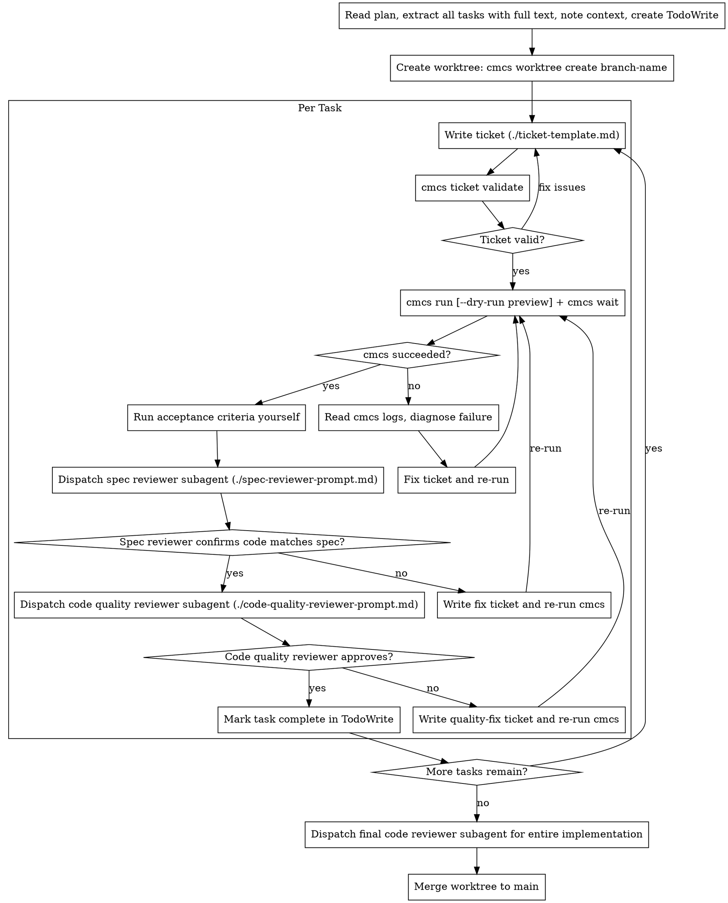

# cmcs-Driven Development

Execute plan by writing cmcs tickets for Codex agents, with two-stage Claude review after each: spec compliance review first, then code quality review.

**Core principle:** Codex implements via tickets + Claude reviews (spec then quality) = high quality, orchestrator never implements

## When to Use



**vs. Subagent-Driven Development:**
- Codex agents implement (not Claude subagents)
- Tickets must be fully self-contained (Codex can't ask questions)
- Async execution via `cmcs run` + `cmcs wait`
- Model selection matters (gpt-5.4 / gpt-5.3-codex / spark / codex-max)
- Claude subagents still handle review (spec + quality)

**For large projects (10+ files, multi-phase):** Read the [large implementation preparation guide](../docs/cmcs-large-implementation-preparation.md) first — it covers research, design docs, phased execution, and handover documents.

## The Process



## Ticket Writing

See `./ticket-template.md` for the full template.

**Pre-flight validation:** After writing tickets, run `cmcs ticket validate <path>` to check for formatting issues and model/scope mismatches (e.g., spark model assigned to tickets referencing 8+ files). Optionally run `cmcs run --dry-run <path>` to preview which tickets will be processed.

**Critical:** Tickets must be completely self-contained. The default cmcs config uses `--sandbox danger-full-access`, which grants Codex full filesystem access. If you need true isolation, override `codex.args` in `.cmcs/config.yml` with restrictive sandbox settings.

**Model selection:** See the [Model Selection Guide](../docs/model-selection.md) for the full catalog and selection heuristics.

## Prompt Templates

- `./ticket-template.md` - Write cmcs tickets for Codex agents
- `./spec-reviewer-prompt.md` - Dispatch spec compliance reviewer (Claude subagent)
- `./code-quality-reviewer-prompt.md` - Dispatch code quality reviewer (Claude subagent)

## Worktree Strategy

See the [orchestration guide](../docs/orchestration-guide.md) for dispatch strategy, parallel launch pattern, and commands.

## Auto-Commit Behavior

Since v0.3.0, cmcs auto-commits worktree changes after each successful ticket (when `codex.auto_commit` is `true`, which is the default). This means:

- **Reviewing:** Use `git log` and `git diff HEAD~1` in the worktree to see exactly what Codex changed, rather than looking at uncommitted files.
- **SHA references:** When dispatching the code quality reviewer, `HEAD_SHA` is the auto-commit and `BASE_SHA` is the commit before `cmcs run`.
- **Disabling:** Set `codex.auto_commit: false` in `.cmcs/config.yml` if you prefer to review uncommitted changes and commit manually.

## Fallback Model

Configure `codex.fallback_model` in `.cmcs/config.yml` to automatically retry failed tickets with a larger model when the failure is due to context-length or output-token limits. Example:

```yaml
codex:
  model: gpt-5.3-codex
  fallback_model: gpt-5.1-codex-max
```

This eliminates manual re-dispatch for model-capacity failures.

## Example Workflow

```
You: I'm using cmcs-Driven Development to execute this plan.

[Read plan file once]
[Extract all 5 tasks with full text and context]
[Create TodoWrite with all tasks]
[Create worktree: cmcs worktree create feat/new-feature]

Task 1: Add data model

[Write TICKET-001.md with full task text, context, acceptance criteria]
[Validate: cmcs ticket validate worktrees/feat/new-feature — all OK]
[Copy ticket to worktree: cp to worktrees/feat/new-feature/.cmcs/tickets/]
[cmcs run worktrees/feat/new-feature]
[cmcs wait worktrees/feat/new-feature]

cmcs: Completed (1/1 tickets passed)

[Run acceptance criteria: build + test — all pass]
[Review changes: git -C worktrees/feat/new-feature log --oneline -3]

[Dispatch spec compliance reviewer (Claude subagent)]
Spec reviewer: APPROVED — all requirements met, nothing extra

[Get git SHAs, dispatch code quality reviewer (Claude subagent)]
Code reviewer: Strengths: Good. Issues: None. Approved.

[Mark Task 1 complete]

Task 2: Refactor API handler

[Write TICKET-002.md with full context]
[Copy to worktree, cmcs run, cmcs wait]

cmcs: Completed (1/1 tickets passed)

[Run acceptance criteria — all pass]

[Dispatch spec compliance reviewer]
Spec reviewer: ISSUES:
  - Missing: Fallback error handler (spec requirement)
  - Extra: Added logging middleware (not requested)

[Write TICKET-002-fix.md: "Add error fallback, remove logging middleware"]
[cmcs run, cmcs wait]

[Dispatch spec reviewer again]
Spec reviewer: APPROVED

[Dispatch code quality reviewer]
Code reviewer: Strengths: Solid. Issues (Important): Magic timeout value

[Write TICKET-002-quality.md: "Extract TIMEOUT constant"]
[cmcs run, cmcs wait]

[Dispatch code quality reviewer again]
Code reviewer: APPROVED

[Mark Task 2 complete]

...

[After all tasks]
[Dispatch final code reviewer for entire worktree diff]
Final reviewer: All requirements met, ready to merge

[Merge worktree to main]
Done!
```

## Advantages

**vs. Subagent-Driven Development:**
- Codex handles heavy implementation (cost-efficient)
- Tickets create audit trail of exactly what was requested
- Model selection optimizes cost/quality per task
- Parallel worktrees for independent tasks (true parallelism)

**vs. Raw cmcs (no structured review):**
- Two-stage review catches spec drift and quality issues
- Review loops ensure fixes actually work
- Spec compliance prevents over/under-building by Codex
- Code quality ensures maintainable output

**Quality gates:**
- Acceptance criteria run by orchestrator (not trusted from Codex)
- Spec compliance review by Claude subagent (independent verification)
- Code quality review by Claude subagent (catches what Codex misses)
- Review loops ensure fixes are verified
- Final review catches cross-task integration issues

## Troubleshooting

**Ticket fails (`cmcs` reports failed status):**
1. Check logs: `cmcs logs <worktree-path>` (use `--follow` for live output, `--lines N` for more context)
2. Check stderr for model-limit errors — if `fallback_model` is configured, cmcs retries automatically
3. Read the agent's stdout to see where it got stuck
4. Fix the ticket (clearer instructions, different model, narrower scope) and re-run

**Re-running after a failure:**
- cmcs only processes tickets where `done: false` — already-completed tickets are skipped
- If the agent partially completed work, review it before re-running (it won't undo partial changes)
- For multi-ticket worktrees, only the failed ticket and subsequent ones will re-run

**Interrupted/orphaned runs:**
- cmcs auto-recovers orphaned runs (process died) on the next `cmcs run`, `cmcs status`, or `cmcs wait`
- Use `cmcs status --active` to see only running runs
- Use `cmcs status --latest` to see only the most recent run per worktree

**Cleanup:**
- `cmcs clean --logs-days 7` removes logs older than 7 days
- `cmcs clean --purge-archived` removes archived worktree records from the database

## Red Flags

See the [orchestration guide](../docs/orchestration-guide.md) for general cmcs rules and review checklist. Additional review-specific red flags:

- **Start code quality review before spec compliance is APPROVED** (wrong order)
- Skip reviews (spec compliance OR code quality)
- Move to next task while either review has open issues
- Skip the re-review after a fix ticket
- Trust Codex's self-reported success (run acceptance criteria yourself)

**If reviewer finds issues:**
1. Write a targeted fix ticket describing exactly what to change
2. Run cmcs again in the same worktree
3. Re-dispatch the same reviewer
4. Repeat until approved

**Trivial fixes only:** If a review issue is a one-line change (rename a constant, fix a typo), the orchestrator MAY fix it directly rather than writing a ticket. Use judgment — if there's any complexity, write a ticket.

## Integration

**Required process docs:**
- **[Orchestration Guide](../docs/orchestration-guide.md)** — dispatch patterns, ticket writing, review checklist
- **[Large Implementation Preparation](../docs/cmcs-large-implementation-preparation.md)** — for large projects (10+ files)

**Required workflow skills:**
- **superpowers:writing-plans** — Creates the plan this skill executes
- **superpowers:requesting-code-review** — Code review template for reviewer subagents
- **superpowers:verification-before-completion** — Verify before claiming done

**Review subagents use:**
- **superpowers:requesting-code-review** — Code quality review template

**Alternative workflow:**
- **superpowers:subagent-driven-development** — Use Claude subagents instead of Codex for implementation

## Recommended Configuration

Create `.cmcs/config.yml` in your project root after `cmcs init`:

```yaml
codex:
  model: gpt-5.3-codex           # default model for tickets without model: override
  fallback_model: gpt-5.1-codex-max  # auto-retry on context/output-token limit failures
  auto_commit: true               # auto-commit worktree after successful ticket (default)
  timeout_s: 1800                 # 30 min timeout per ticket (default)

worktrees:
  root: worktrees                 # worktree directory (default)
  start_point: master             # branch to create worktrees from (default)
```

See the [Configuration Reference](../docs/configuration.md) for all options.
